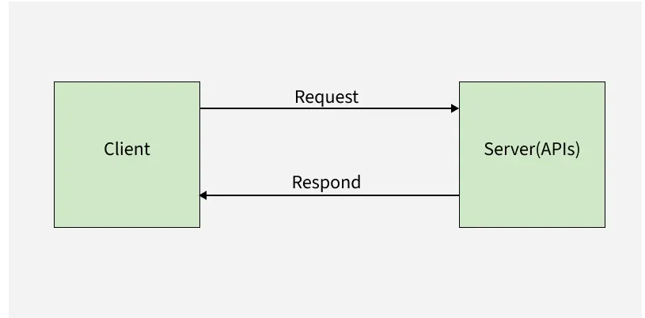
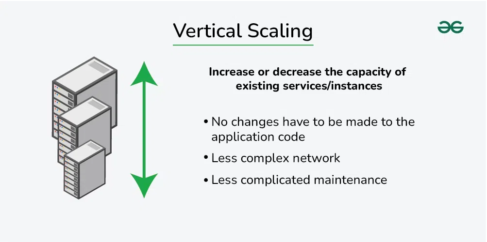

# Scaling
Scaling is one of the important topics in System design or System architecture.Scaling is a basically a process to increase the System Capacity so it can handle more traffic and work load.
  
As an application grows, the number of users, requests, and data also increases and if the system is not designed in a efficient way (scaled properly), it may cause the application to run slow, crash frequently and also stop working sometimes.

## Client - Server Architecture:
Before we get into scaling and the process of scaling it is important for us to understand how most of the applications work, ie - the Client Server Architecture. 
  
Client - server architecture is basically a 2 way process where:
- The client(Browser / Mobile app or the Frontend) sends a request to the server (Backend)
- The backend recieves the request and in return sends a respoonse.
 

  

 
As the nummber of users increase, the server gets more requests, which can cause overload on the server. Scaling helps the server handle more clients without downtime or slow performance.

## Types of Scaling
There are basically 2 types of Scaling methods :
- Vertical Scaling
- Horizontal Scaling
 

### Vertical Scaling :
- Vertical scaling is the process of increasing the capacity of a single machine by adding more resources to a single server such as memory, storage etc. 
- It is also known as Scale up approach. 

  

2) 