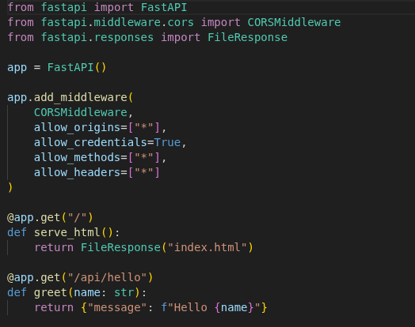
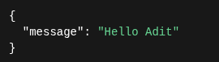
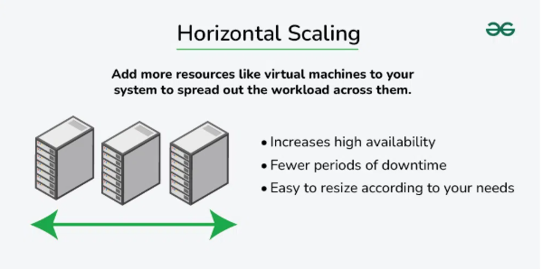
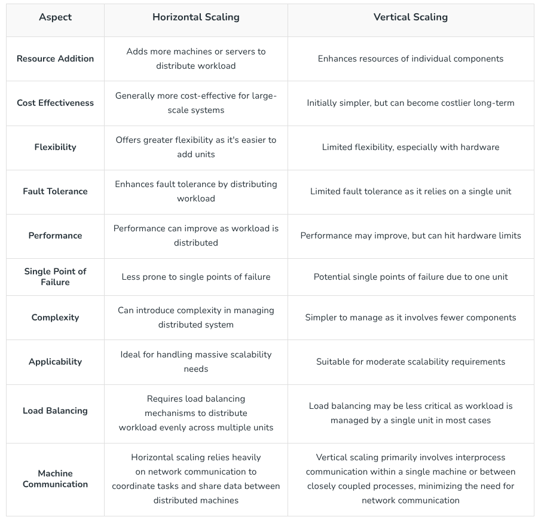

# INTRO TO SCALING
This README file is to introduce users to the most important prt of System design or system architecture - Scaling. We will understand what is Scaling and the types of Scaling using a simple example built by using FastAPI. 

## The example application
We in this tutorial use a very simple hello {name} application built using FastAPI. 

  

<b>Example Request: </b>

  

<b>Example Response: </b>

  

## Scaling
Scaling is one of the important topics in System design or System architecture.Scaling is a basically a process to increase the System Capacity so it can handle more traffic and work load.
  
As an application grows, the number of users, requests, and data also increases and if the system is not designed in a efficient way (scaled properly), it may cause the application to run slow, crash frequently and also stop working sometimes.

## Client - Server Architecture:
Before we get into scaling and the process of scaling it is important for us to understand how most of the applications work, ie - the Client Server Architecture. 
  
Client - server architecture is basically a 2 way process where:
- The client(Browser / Mobile app or the Frontend) sends a request to the server (Backend)
- The backend recieves the request and in return sends a respoonse.
 

  

 
As the nummber of users increase, the server gets more requests, which can cause overload on the server. Scaling helps the server handle more clients without downtime or slow performance.

## Types of Scaling
There are basically 2 types of Scaling methods :
- Vertical Scaling
- Horizontal Scaling
 

### Vertical Scaling :
- Vertical scaling is the process of increasing the capacity of a single machine by adding more resources to a single server such as memory, storage etc. 
- It is also known as Scale up approach. 

  

  

<u><b>Advantages: </b></u>
- <b>Increased capacity: </b> A server's performance and ability to manage incoming requests can both be enhanced by upgrading its hardware.
- <b>Easier management: </b> Upgrading a single node is usually the focus of vertical scaling, which might be simpler than maintaining several nodes.

 

<u><b>Disadvantages: </b></u>
- <b>Limited Scalability: </b> Vertical scaling is constrained by the hardware's physical limitations. Horizontal Scaling is not limited.
- One server still receives all incoming requests thus increasing the possibility of downtime in the event of a server failure.
- Scaling up often requires restarting or replacing the machine, causing downtime.

  

### Horizontal Scaling :
- Horizontal scaling is a process of increasing the the capacity or performance of an application by adding more machines or servers so the incoming workload or the requests are distributed across a large number of servers.
- It is also known as Scaling out approach. 

  

  

<u><b>Advantages: </b></u>
- <b>Increased capacity: </b> More nodes or instances can handle a larger number of incoming requests.
- <b>Improved performance: </b> By distributing the load over several nodes or instances, it is less likely that any one server will get overloaded.
- <b>Increased fault tolerance: </b> Incoming requests can be sent to another node in the event of a node failure, lowering the possibility of downtime.

 

<u><b>Disadvantages: </b></u>
- Requires complex architecture (load balancers, distributed databases, etc.).
- More machines = more networking, power, and maintenance.
- Needs orchestration tools (e.g., Kubernetes, Ansible) to manage many servers.
- Communication between nodes adds latency and complexity.
- Issues can be spread across nodes, making root-cause analysis tricky.

  

### Core differences between Horizontal and Vertical scaling: 

  

  